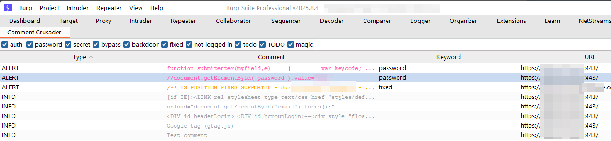

# Comment Crusader

Author: **Farzan Karimi (@jumpycastle)**  
License: **MIT**

---
## 📖 Overview
**Source Intelligence for Burp Suite.**

Comment Crusader is a Burp Suite extension that detects, catalogs, and exports developer comments, keywords, and potential secrets embedded in HTTP responses — including both HTML and JavaScript content. It’s a handy recon and code-review assistant for identifying exposed insights, internal notes, and credential leaks during security assessments.


---

## 🔍 Features

- 🧠 **Keyword Detection**: Scans for hardcoded credentials, internal references, TODOs, and sensitive terms.
- 🗂️ **Categorized Results**: Flags items as `ALERT` (keyword match) or `INFO` (general comment).
- 📜 **Multi-type Support**: Extracts from JavaScript, HTML, and response bodies.
- 🌐 **Live Scanning & Replay**: Works in Proxy, Repeater, and Scanner traffic.
- ⚙️ **Custom Keyword Support**: Edit or expand your own alert keyword list.
- 🎯 **Right-click Actions**: Send findings directly to Burp Repeater.

---

## 🚀 Installation

1. Install **Jython 2.7.x** and configure it in Burp under:
   `Extender` → `Options` → `Python Environment`.
2. Clone or download this repo:
   ```bash
   git clone https://github.com/jumpycastle/comment-crusader.git

## 🚀 Usage
1. Simply load the extension and start capturing traffic for the target web application.
2. Note the color-coded alerts appearing during live-traffic capture



3. Profit. 

## 🚀 Demo

